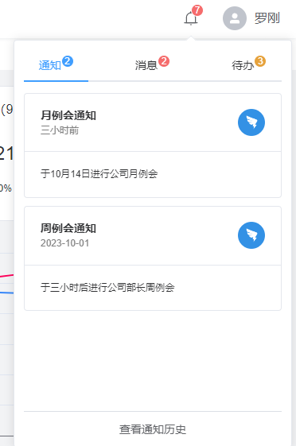

# 通知组件

该组件包含`通知`、`消息`、`待办`三个模块。根据具体需要可以进行修改和删减。

## 基本

:::info
    组件位置`@/components/Notify`
:::



组件内部数据由于`@/components/Notify/data.js`提供，真实场景需要进行替换sse（server-sent events）、websocket或其他方式。

## 数据结构

`data.js`中提供三个对象。

- **notifyData：** 通知数据集合。
- **messageData：** 消息数据集合。
- **todoData：** 待办数据集合。

| 属性名 | 说明 | 类型 |
| :--: | :--: | :--: |
| avatar | 通知图标，可以不写 | string |
| title | 通知标题 | string |
| datetime | 通知时间 | string |
| description | 通知详情 | string |

**示例**

```
[
    {
        avatar: 'https://gw.alipayobjects.com/zos/rmsportal/OKJXDXrmkNshAMvwtvhu.png',
        title: '月例会通知',
        datetime: '三小时前',
        description: '于10月14日进行公司月例会',
    },
    {
        avatar: 'https://gw.alipayobjects.com/zos/rmsportal/OKJXDXrmkNshAMvwtvhu.png',
        title: '周例会通知',
        datetime: '2023-10-01',
        description: '于三小时后进行公司部长周例会',
    },
]

```