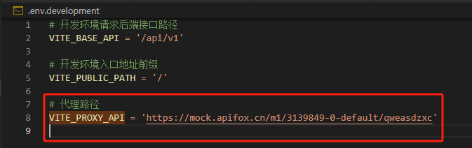

# 跨域

在开发环境下，跨域采用了`vite`提供的中转代理进行。

通过`vite`配置文件`vite.config.js`配置`server.proxy`


:::tip
    详细的配置项可参考vite文档：https://cn.vitejs.dev/config/server-options.html#server-proxy
:::
## 示例

- VITE_PROXY_API: 在`.env.development`中配置

```javascript
export default defineConfig(({mode}) => {
    return {
        server: {
            proxy: {
                '/api': {
                    target: VITE_PROXY_API, // 要代理到的url
                }
            }
        }
    }
})
```



当使用request发送请求到 `/api/v1/login` 时，会被代理到
`https://mock.apifox.cn/m1/3139849-0-default/qweasdzxc` + `/api/v1/login`

即

`https://mock.apifox.cn/m1/3139849-0-default/qweasdzxc/api/v1/login`
