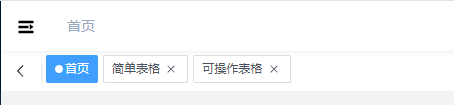

# 快捷导航

这是一个在header下的一个标签栏导航。部分场景可能会使用。

## 标签导航栏



当前被打开过的页面储存在`tagsViewStore.visitedViews`中，在使用时一般会和`keep-alive`配合。达到缓存已打开页面的效果。

因此在使用时要注意是否有在`app-main`中配置`keep-alive`。

:::tip
文件位置`@/layout/components/TagsView`
:::

## Affix 固定Tag

在路由的`meta`中添加`affix:true`可以起到固定标签的作用，标签中将不再提供删除按钮，会一直固定在标签栏。

例子：
```javascript
    {
        path: '/',
        component: layout,
        children: [
            {
                path: '',
                component: () => import('@/views/home/index.vue'),
                name: 'Home',
                meta: {
                    title: '首页',
                    svgIcon: 'dashboard',
                    affix: true,
                },
            },
        ],
    },

```